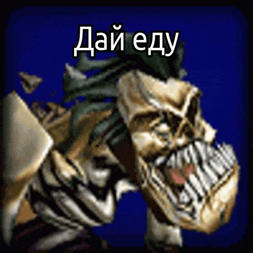
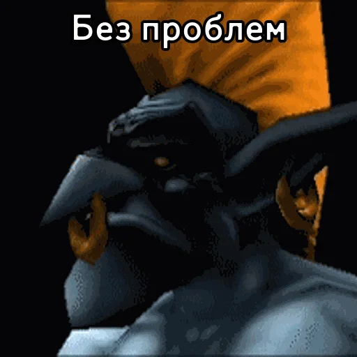
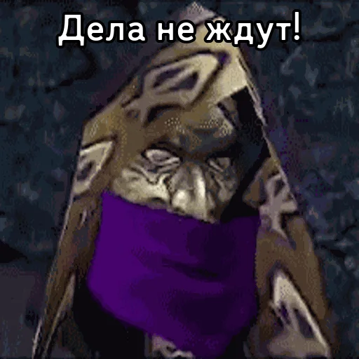

# Warcraft III Python stickers maker

## Навигация
+ [Stage 1](https://github.com/daniilboyarinkov/Warcraft_III_Python_Stickers_Maker#stage-1)
+ [Stage 2](https://github.com/daniilboyarinkov/Warcraft_III_Python_Stickers_Maker#stage-2)
+ [Stage 3](https://github.com/daniilboyarinkov/Warcraft_III_Python_Stickers_Maker#stage-3)

   <h2>Проект развернулся в 3 этапа.</h2>

1. Был реализован код создания стикеров юнитов **Warcraft III**.
[Вы находитесь здесь ⬇️](https://github.com/daniilboyarinkov/Warcraft_III_Python_Stickers_Maker)
2. Были добавлены **все** юниты основных 4 фракций.
3. Был реализован бот на **Node JS**. Он отправляет стикер и озвученную фразу выбранного персонажа.
[Это находится здесь](https://github.com/daniilboyarinkov/Warcraft_III_Sticker_bot)

Бот в _**Telegram**_: 

      @BDW_Warcraft_III_Stickers_bot

## Here are __Telegram sticker packs__ 
(that were made and published automatically)
### Stage 1 of the project
 + [Night Elf](https://t.me/addstickers/WC3_NE)
 + [Orc](https://t.me/addstickers/WC3_Orc)
 + [Undead](https://t.me/addstickers/WC3_UD)
 + [Humans](https://t.me/addstickers/WC3_Humans)

### Stage 2 of the project

 + [Night Elf | Part 1](https://t.me/addstickers/Warcraft3_Night_Elf_Part1)
 + [Night Elf | Part 2](https://t.me/addstickers/Warcraft3_Night_Elf_Part2)
 + [Orc | Part 1](https://t.me/addstickers/Warcraft3_Orc_Part1)
 + [Orc | Part 2](https://t.me/addstickers/Warcraft3_Orc_Part2)
 + [Orc | Part 3](https://t.me/addstickers/Warcraft3_Orc_Part3)
 + [Undead | Part 1](https://t.me/addstickers/Warcraft3_Undead_Part1)
 + [Undead | Part 2](https://t.me/addstickers/Warcraft3_Undead_Part2)
 + [Humans | Part 1](https://t.me/addstickers/Warcraft3_Human_Part1)
 + [Humans | Part 2](https://t.me/addstickers/Warcraft3_Human_Part2)
 + [Humans | Part 3](https://t.me/addstickers/Warcraft3_Human_Part3)

# Stage 1

### Here is just one sticker from [Night Elf](https://t.me/addstickers/WC3_NE) Sticker Pack.

   

### And that's one from [Orc](https://t.me/addstickers/WC3_Orc) Sticker Pack

   

### That's one from [Undead](https://t.me/addstickers/WC3_UD) Sticker Pack

   

### And that's from [Humans](https://t.me/addstickers/WC3_Humans) Sticker Pack

   

# Stage 2

### Here is just one sticker from [Night Elf](https://t.me/addstickers/Warcraft3_Night_Elf_Part1) Sticker Pack.

   

### And that's one from [Orc](https://t.me/addstickers/Warcraft3_Orc_Part1) Sticker Pack

   

### That's one from [Undead](https://t.me/addstickers/Warcraft3_Undead_Part1) Sticker Pack

   

### And that's from [Humans](https://t.me/addstickers/Warcraft3_Human_Part1) Sticker Pack

   

---

*С остальными стикерами вы можете ознакомиться самостоятельно.*

---

# Stage 3

Бот в _**Telegram**_: 

      @BDW_Warcraft_III_Stickers_bot

### In that project I used:
 + Python Telegram user bot (to automate the publishing of sticker packs)
   + Pyrogram
 + Resizing and compressing GIF files in Python
   + Pillow
 + Automatically adding text (words of characters) to GIF
   + Pillow
 + Wrapping text and calculating appropriate font size of text
   + Text Wrapper
 + A little of math formulas that just suddenly appeared in my head
 
---

### Stage 1 of the project

   

### Stage 2 of the project

   

---

> I'm just learning...
