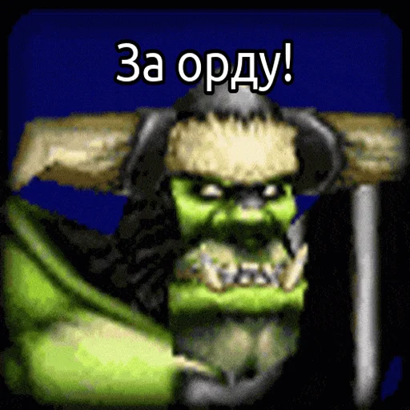
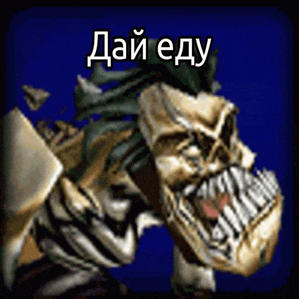
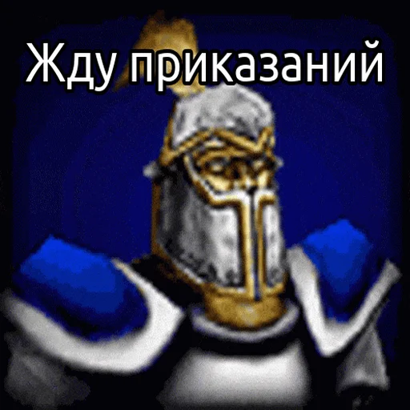
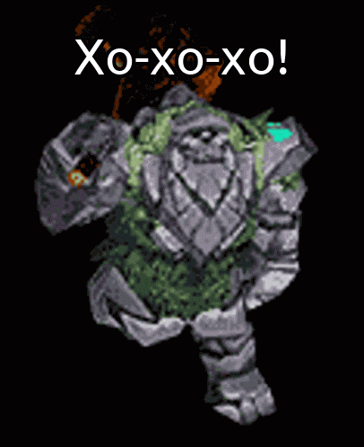

# BittoCheat_Telegram_Warcraft3_bot

Well, that's not actually a bot yet. Here are just some python scripts that I used to automatically create Warcraft III sticker packs.

> But I'm doing all my best to bring my idea into life...

---

Furthermore, I do really hope that one day I'll rewrite this project to __JS__ (because of many reasons of course, not because I just want it)

> The final version of that bot will be written in JS. I swear...

---

## Here are my __Telegram sticker packs__ (that were made and published automatically):
 + [Night Elf](https://t.me/addstickers/WC3_NE)
 + [Orc](https://t.me/addstickers/WC3_Orc)
 + [Undead](https://t.me/addstickers/WC3_UD)
 + [Humans](https://t.me/addstickers/WC3_Humans)

---

# Here is just one sticker from [Night Elf](https://t.me/addstickers/WC3_NE) Sticker Pack.

---

# And that's one from [Orc](https://t.me/addstickers/WC3_Orc) Sticker Pack

---

# That's one from [Undead](https://t.me/addstickers/WC3_UD) Sticker Pack

---

# And that's from [Humans](https://t.me/addstickers/WC3_Humans) Sticker Pack

---

*All other stickers you can easily see by yourself by following links above...*

---

### In that project I used:
 + Python Telegram user bot (to automate the publishing of sticker packs)
   + Pyrogram
 + Resizing and compressing GIF files in Python
   + Pillow
 + Automatically adding text (words of characters) to GIF
   + Pillow
 + Wrapping text and calculating appropriate font size of text
   + Text Wrapper
 + A little of math formulas that just suddenly appeared in my head

---

Probably I'll remake plenty of these stickers into more nicely-looking ones in the nearest future. And also, I'm going to add many other characters that unfortunately ain't there yet...

#### At Least I hope that I would have an opportunity to make all of that stuff...

---

---

> I'm just learning...
